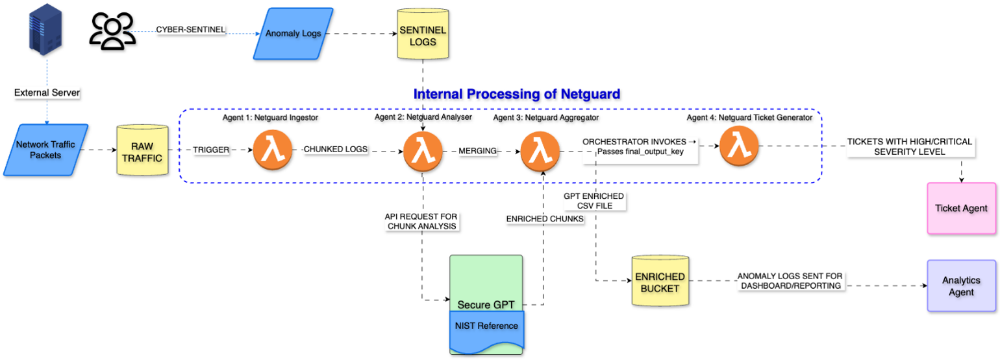
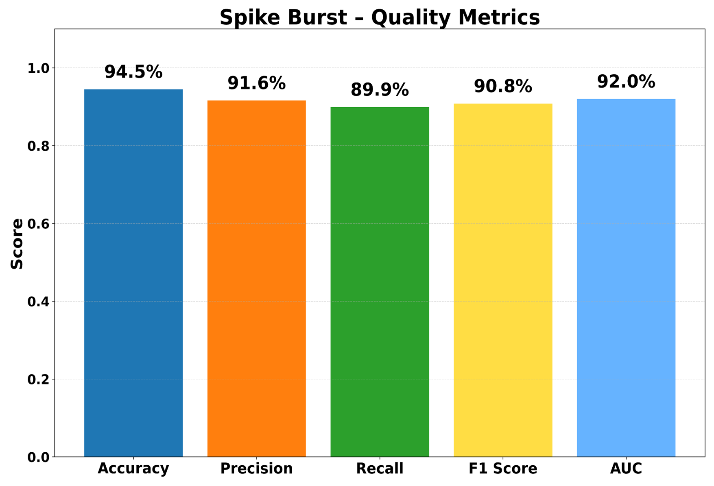

# NetGuard – Agentic AI for Real‑Time Network Traffic Monitoring & Proactive Threat Mitigation

## Overview

NetGuard is an AI-powered, serverless cybersecurity pipeline designed for real-time network traffic analysis and threat mitigation. Built on AWS Lambda and integrated with SecureGPT, NetGuard automates the entire security workflow—from ingesting network logs and correlating them with known anomalies, to enriching them using GPT-based intelligence and generating JIRA tickets for high-severity threats. The system leverages modular agents that ensure scalability, compliance with NIST SP 800-53 standards, and adaptability to evolving threat landscapes. By combining cloud-native infrastructure, anomaly detection, and large language model reasoning, NetGuard transforms raw packet data into actionable threat intelligence—enabling proactive, intelligent, and auditable cyber defense

## 🧪 Datasets Used
- `network_packets.csv`: Simulated network traffic with fields like Protocol, Flags, PacketSize, Status
- `anomaly_logs.csv`: Generated by Faker with AnomalyType, LogLevel, NISTReference
- `NIST.SP.800-53r5.pdf`: Grounding document for SecureGPT

  
## 🧩 System Architecture

NetGuard is composed of four core Lambda agents deployed in a serverless pipeline:

- **Agent 1 - NetGuard Ingestor**: S3-triggered Lambda that preprocesses and chunks raw traffic files.
- **Agent 2 - NetGuard Analyzer**: Matches logs with anomalies and invokes SecureGPT for enrichment.
- **Agent 3 - NetGuard Aggregator**: Merges chunked outputs into a unified final log.
- **Agent 4 - Ticket Generator**: Automatically creates JIRA tickets for critical threats.

All enriched outputs are uploaded to Cyber Vision for dashboard integration.

---

## 🤖 Agent Breakdown

### 1. `NetGuard Ingestor`
- **Trigger**: S3 event (new file uploaded)
- **Tasks**: Normalize, chunk, and store logs
- **Output**: 100-row CSV chunks in `netguard-analyzed-chunks/`

### 2. `NetGuard Analyzer`
- **Input**: Chunked packets + anomaly logs
- **Logic**:
  - Match IPs with anomaly logs
  - Construct structured SecureGPT prompt
  - Receive: ThreatSeverity, ActionTaken, Explanation
- **Output**: Enriched CSV

### 3. `NetGuard Aggregator`
- **Input**: Analyzed chunks
- **Tasks**: Validate, concatenate, and export full report
- **Output**: Final threat log in `netguard-final-output-logs/`

### 4. `NetGuard Ticket Generator`
- **Trigger**: New file in final output bucket
- **Logic**:
  - Filter High/Critical threats
  - Push JIRA tickets via API

---

---

## 🧪 Testing & Evaluation
| Dataset Size | Accuracy | Precision | Recall | F1-Score | ROC AUC |
|--------------|----------|-----------|--------|----------|---------|
| 3000 rows    | 90.9%    | 92.4%     | 96.6%  | 94.5%    | 0.93    |
| 6000 rows    | 94.5%    | 91.6%     | 89.9%  | 90.8%    | 0.92    |

- **Post-Reflexion Improvements**: Reflexive updates improved precision.
- **Load Handling**: Parallel chunking & SecureGPT invocation scaled efficiently.

---

## 🎬 Demo Video (Google Drive)

<h3>🎬 Demo Video</h3>
<iframe src="https://drive.google.com/file/d/1-fz5eYod2dFaeJBlZmV9zpTHp0o6I0WW/preview" width="640" height="360" allow="autoplay"></iframe>

---

## 🚀 Deployment Stack
- **Infrastructure**: AWS Lambda, S3, CloudWatch, IAM
- **Data Handling**: Pandas, boto3
- **Inference API**: SecureGPT (Accure.ai)
- **Ticketing**: JIRA REST API

---

## 📈 Future Work
- Add real-time packet capture (PyShark/Scapy)
- Switch to EC2 for higher volume processing
- Integrate Splunk/ELK dashboards from Cyber Vision
- Support other frameworks (MITRE ATT&CK)

---

## 📚 References
- NIST Cybersecurity Framework  
- Accure Inc. SecureGPT API Docs  
- Erasmus.AI Agentic AI Insights

---

> ✨ Empowering proactive cyber defense through agentic intelligence.
"""

# Save as README.md
output_path = Path("/mnt/data/README.md")
output_path.write_text(readme_content)

output_path

